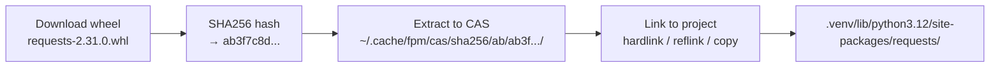

# Content-Addressable Storage (CAS)

## What It Is

CAS is fpm's core storage model. Every package is stored exactly once,
identified by the SHA256 hash of its wheel file. Multiple projects and
environments can reference the same stored package without duplicating data on
disk.

## How It Works



```
1. Download wheel:     requests-2.31.0-py3-none-any.whl
2. Hash it:            SHA256 → ab3f7c8d...
3. Extract to CAS:     ~/.cache/fpm/cas/sha256/ab/ab3f7c8d.../
4. Link to project:    .venv/lib/python3.12/site-packages/requests/ → CAS (hardlink)
```

The CAS path uses the first 2 characters of the hash as a prefix directory
(prevents a single directory from having thousands of entries):

```
~/.cache/fpm/cas/sha256/
├── ab/
│   └── ab3f7c8d9e1f2a3b4c5d6e7f8a9b0c1d.../
│       ├── requests/
│       └── requests-2.31.0.dist-info/
├── 7f/
│   └── 7f952cbe720b688055e3f87de14f5c3e.../
│       ├── urllib3/
│       └── urllib3-2.0.0.dist-info/
└── ...
```

## Why CAS Matters

### Zero Duplication

Without CAS (pip/traditional):

```
project-a/.venv/lib/.../requests/     → 500 KB (copy)
project-b/.venv/lib/.../requests/     → 500 KB (copy)
project-c/.venv/lib/.../requests/     → 500 KB (copy)
Total: 1.5 MB
```

With CAS (fpm):

```
~/.cache/fpm/cas/.../requests/        → 500 KB (single copy)
project-a/.venv/lib/.../requests/     → hardlink (0 bytes extra)
project-b/.venv/lib/.../requests/     → hardlink (0 bytes extra)
project-c/.venv/lib/.../requests/     → hardlink (0 bytes extra)
Total: 500 KB
```

### Instant Re-installs

When you `fpm sync` or reinstall a package, fpm checks the CAS first. If the
hash exists, installation is just creating links — no download, no extraction.
This makes operations like `fpm snapshot restore` near-instant.

### Safe Garbage Collection

fpm tracks which environments reference which CAS entries (via `refs/`). When no
environment uses a package anymore, `fpm cache gc` can safely remove it. This is
impossible without content-addressing — you'd need to scan every venv on the
system.

## Linking Strategies

fpm selects the best available method:

| Strategy | Filesystem               | Space | Speed   | Data safety   |
| -------- | ------------------------ | ----- | ------- | ------------- |
| Reflink  | APFS (macOS), btrfs, xfs | Zero  | Instant | Copy-on-write |
| Hardlink | All Unix                 | Zero  | Instant | Shared inode  |
| Copy     | Anywhere                 | Full  | Slow    | Independent   |

**Reflink** is the best — it's like a hardlink but modifications to one copy
don't affect others (copy-on-write semantics). Available on modern macOS (APFS)
and Linux (btrfs, xfs with reflink support).

**Hardlink** shares the actual inode. Editing the file in one location changes
it everywhere. Since Python packages are read-only, this is safe.

**Copy** is the fallback for cross-filesystem scenarios (Docker overlay2,
network mounts) or Windows.

## Developer Reference

Key code paths:

- `internal/cache/cache.go` — `Store()`, `Retrieve()`, `CASDir()`
- `internal/fs/link.go` — `LinkDir()`, `LinkFile()`, link mode selection
- `internal/cache/reference.go` — `RefTracker`, `AddReference()`,
  `RemoveReference()`

The `Store()` function:

1. Hashes the wheel → `CASKey{Algorithm: "sha256", Digest: "ab3f..."}`
2. Checks if `cas/sha256/ab/ab3f.../` exists → skip if yes
3. Extracts wheel ZIP to `tmp/extract-{hash}/`
4. Atomic rename to final CAS path
5. Returns the CASKey for reference tracking
