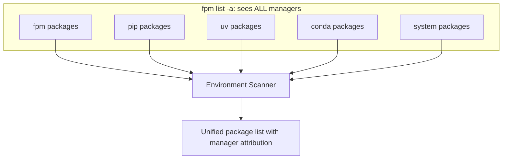

# Cross-Manager Coexistence

## Philosophy

fpm is designed to work alongside other Python package managers — not replace
them. Your environment may have packages from pip, uv, conda, poetry, pdm, and
system packages. fpm sees all of them.

## How Detection Works

Every installed Python package has a `.dist-info/` directory containing
metadata. Inside that directory, the `INSTALLER` file records which tool
installed it:

```
.venv/lib/python3.12/site-packages/
├── requests-2.31.0.dist-info/
│   ├── METADATA
│   ├── RECORD
│   └── INSTALLER          ← contains "fpm\n" or "pip\n" or "uv\n"
├── numpy-1.24.0.dist-info/
│   └── INSTALLER          ← contains "pip\n"
```

fpm reads this file to determine the manager. If no INSTALLER file exists, it
falls back to path heuristics:

- `/usr/lib/python3/` → "system" (distro package)
- Everything else without INSTALLER → "pip" (most likely)

## What You See

```bash
$ fpm list -a
Package            Version    Manager  Location
requests           2.31.0     fpm      /home/user/myproject/.venv/lib/python3.12/site-packages
numpy              1.24.0     pip      /home/user/myproject/.venv/lib/python3.12/site-packages
black              23.1.0     uv       /home/user/myproject/.venv/lib/python3.12/site-packages
scipy              1.10.0     conda    /opt/conda/lib/python3.12/site-packages
pip                23.3.1     system   /usr/lib/python3/dist-packages

$ fpm list --mutable
Package            Version    Manager  Pinned      Location
requests           2.31.0     fpm      🔒 2.31.0   /home/user/myproject/.venv/...
numpy              1.24.0     pip      mutable     /home/user/myproject/.venv/...
```



## Conflict Handling

When you `fpm install numpy` and numpy is already installed by pip:

### Same Version

```
● numpy 1.24.0 is already installed via pip — skipping download
```

No action needed. fpm recognizes it's already available.

### Different Version

Depends on the `cross-manager-policy` setting in `fpm.toml`:

**Policy: `ask`** (default) — Interactive prompt:

```
  numpy 1.24.0 is installed via pip, but you're requesting 2.0.0.
  After installation, fpm's version will take priority based on path order.

  [1] Skip installation (keep pip's 1.24.0)
  [2] Install anyway (fpm's 2.0.0 will shadow pip's)
  [3] Abort

  Choice [1/2/3]:
```

**Policy: `install`** — Automatic install with message:

```
● numpy 1.24.0 exists via pip, installing 2.0.0 (fpm's version will take priority)
```

**Policy: `skip`** — Automatic skip:

```
● numpy 1.24.0 exists via pip, skipping installation of 2.0.0 (policy: skip)
```

## Configuration

```toml
# fpm.toml or ~/.config/fpm/config.toml
[tool]
cross-manager-policy = "ask"    # ask | install | skip
```

## How "Shadowing" Works

Python finds packages by walking `sys.path` in order. When fpm installs a
package that pip also has, both versions exist on disk. Which one Python uses
depends on which `site-packages` directory comes first in `sys.path`.

In a venv, the venv's `site-packages` comes first — so fpm's version wins. The
pip version still exists but is effectively invisible to Python.

## Environment Snapshots

Snapshots capture packages from ALL managers. When you restore a snapshot:

- **fpm packages**: restored from CAS (instant, exact version)
- **Other managers' packages**: fpm reports drift but doesn't modify them

```bash
$ fpm snapshot restore 20260607-143000
  ✓ Restored 12 fpm packages from cache
  ⚠ pip's scipy: expected 1.10.0, found 1.11.0 (drift detected)
```

This is by design — fpm respects other managers' ownership.

## Developer Reference

Key code:

- `internal/env/scanner.go` — `Scan()`, `detectManager()`, `InstalledPackage`
- `internal/env/crossmanager.go` — `CrossManagerChecker`, `Check()`, policy
  handling
- `internal/cli/install_impl.go` — integration point (after resolution, before
  download)
