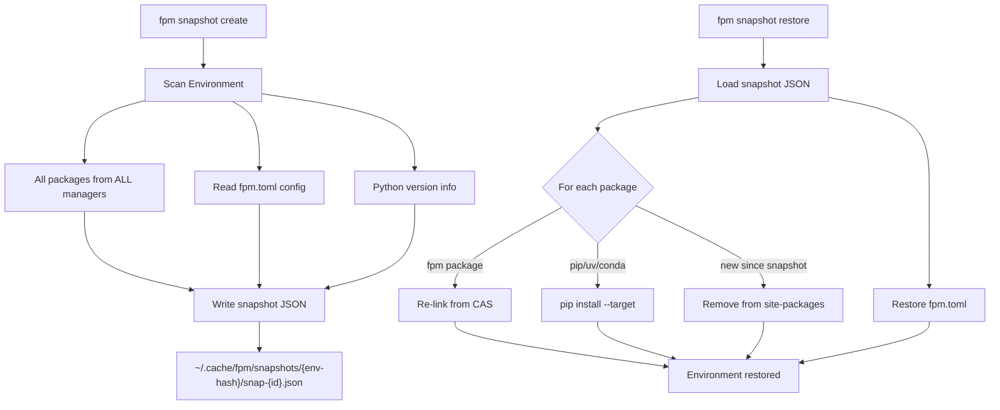
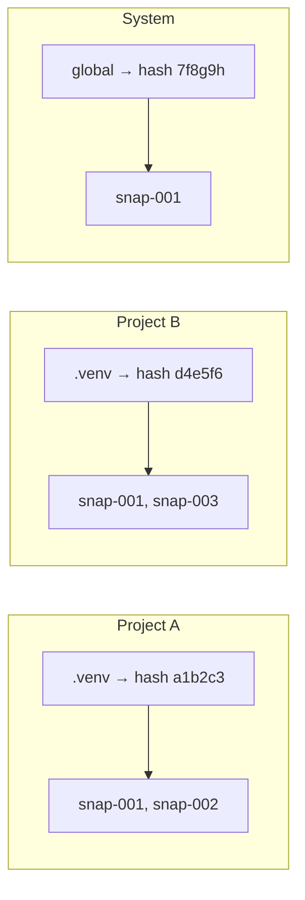
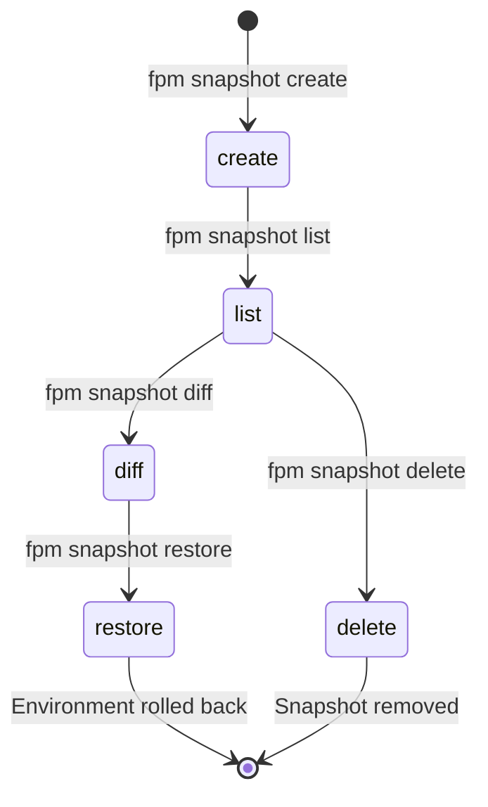

# Environment Snapshots

## What They Are

Snapshots capture the **complete state** of your Python environment at a point
in time — every package from every manager, exact versions, plus your `fpm.toml`
config (immutable pins). Think of it as git commits for your environment.

## Why They Exist

- **Experiment safely**: install experimental packages, restore if things break
- **Reproduce**: share exact environment state with teammates
- **Audit**: see what changed between two points in time
- **Recover**: roll back after a bad `pip install` or accidental upgrade
- **Config safety**: restore immutable pins even if someone changed fpm.toml

## Architecture



## How They Work

### Capture

```bash
fpm snapshot create "before ML experiment"
```

This records:

- Package name, version, and manager (fpm, pip, uv, conda, etc.)
- CAS key (for fpm packages — enables instant restore)
- Python version and path
- `fpm.toml` content (immutable pins, project config)

### Scope

Snapshots are **scoped per environment**:



Each venv has independent history. System-level snapshots use `--system`:

```bash
fpm snapshot create --system "system baseline"
fpm snapshot list --system
fpm snapshot restore --system <id>
```

### Restore

```bash
fpm snapshot restore 20260607-143000-001
```

**Full-fidelity restore** — returns the environment to the exact captured state:

| What changed                     | What restore does                       |
| -------------------------------- | --------------------------------------- |
| fpm package removed              | Re-links from CAS (instant, no network) |
| fpm package missing from CAS     | Re-downloads from PyPI                  |
| pip/uv/conda package removed     | Reinstalls via `pip install --target`   |
| New package added after snapshot | Removes it                              |
| fpm.toml modified                | Overwrites with snapshot version        |
| Immutable config changed         | Reverts to snapshot state               |

### System Conflict Resolution

When restoring a project snapshot that conflicts with system packages, fpm
prompts interactively:

```
  ⚠ System package conflicts detected:
    numpy: snapshot needs 1.24.0, system has 2.0.0 (pip)

  How to resolve?
    [1] Roll back system packages too
    [2] Install at project level (overrides system)
    [3] Abort (fix system packages manually)
  Choice [1/2/3]:
```

Option 2 installs the package at project level, which takes priority over the
system version in Python's import path.

### Diff

```bash
fpm snapshot diff 20260607-100000 20260607-143000
```

```
  + pandas 2.0.0 (fpm)              ← added
  + numpy 1.24.0 (fpm)              ← added
  ~ requests 2.30.0 → 2.31.0 (fpm)  ← version changed
  - flask 2.3.0 (fpm)               ← removed
```

Compare a snapshot against current state:

```bash
fpm snapshot diff 20260607-100000
```

## Snapshot Lifecycle



## Storage Format

```json
{
  "id": "20260607-143000-001",
  "created_at": "2026-06-07T14:30:00Z",
  "message": "before ML experiment",
  "python_version": "3.12.1",
  "python_path": "/path/to/.venv/bin/python3",
  "fpm_toml": "[project]\nname = \"myapp\"\n[immutable]\npackages = [...]",
  "packages": [
    {
      "name": "requests",
      "version": "2.31.0",
      "manager": "fpm",
      "cas_key": "sha256:ab3f7c8d...",
      "location": "/path/to/.venv/lib/python3.12/site-packages"
    }
  ]
}
```

The `cas_key` field enables instant restore — fpm re-links from CAS without
network access. The `fpm_toml` field captures the project config at snapshot
time.

## Developer Reference

Key code:

- `internal/snapshot/snapshot.go` — `Store`, `Capture()`, `List()`, `Get()`,
  `Diff()`
- `internal/snapshot/restore.go` — `Restore()`, CAS re-linking, external package
  restore, config restore
- `internal/cli/snapshot.go` — CLI commands with `--system` scope support
- `internal/env/scanner.go` — `Scan()` captures the environment state
