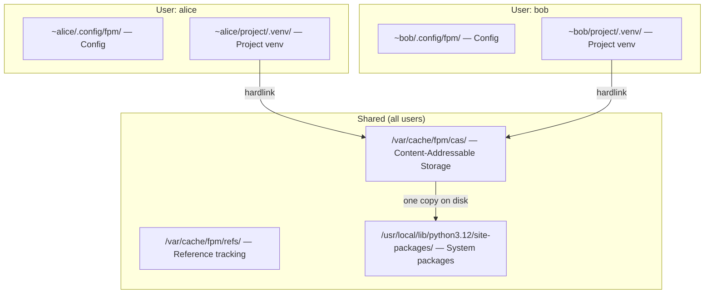
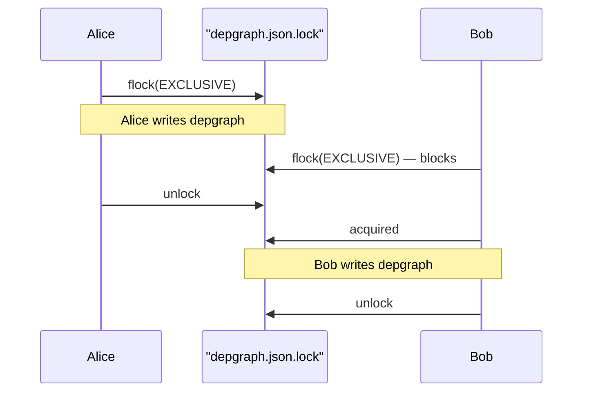

# Multi-User Systems

## Overview

fpm supports two modes of operation: **single-user** (default) and
**multi-user** (shared systems with multiple developers).

## Single-User Mode (Default)

Every user has their own isolated fpm data:

```
~/.cache/fpm/          # Downloaded wheels, CAS, HTTP cache
~/.local/share/fpm/    # Dependency graph, Python installs
~/.config/fpm/         # User configuration
~/project/.venv/       # Per-project virtual environments
```

No coordination needed. Each user is fully independent.

## Multi-User Mode

Enable with:

```bash
fpm config set tool.mode multi-user
```

This switches the CAS cache to a **shared system directory**:



### Benefits

| Feature         | Single-user                 | Multi-user                      |
| --------------- | --------------------------- | ------------------------------- |
| Disk usage      | Each user caches separately | One shared CAS for all          |
| Download        | Each user downloads once    | First user downloads, rest link |
| Project venvs   | Per-user (isolated)         | Per-user (isolated)             |
| System packages | Shared                      | Shared                          |
| Snapshots       | Per-user, per-project       | Per-user, per-project           |
| Config          | Per-user                    | Per-user                        |

### Setup

```bash
# 1. Enable multi-user mode
fpm config set tool.mode multi-user

# 2. Create shared cache directory (as root)
sudo mkdir -p /var/cache/fpm
sudo groupadd fpm
sudo chgrp -R fpm /var/cache/fpm
sudo chmod -R 2775 /var/cache/fpm

# 3. Add users to the fpm group
sudo usermod -aG fpm alice
sudo usermod -aG fpm bob

# 4. (Optional) Set system-wide mode
echo 'multi-user' | sudo tee /etc/fpm/mode
```

After setup, all users share the CAS. When alice installs `requests`, bob gets
it instantly (hardlinked from shared CAS) without downloading.

## Concurrency Safety

### File Locking

fpm uses advisory file locks (`flock`) to prevent corruption when multiple users
write to shared state simultaneously:



**Protected resources:**

- `depgraph.json` — dependency graph (exclusive lock on write, shared on read)
- `refs/by-env/*.json` — per-environment reference index
- `refs/by-cas/*.json` — per-CAS-key reference index

### Atomic Package Replacement

When upgrading a system package, fpm uses atomic replacement to prevent readers
from seeing a half-installed state:

```
1. Install new version to .fpm-install-{pkg}/ (temp)
2. Rename old pkg/ → pkg.old/
3. Rename temp/{pkg}/ → pkg/  (atomic on same filesystem)
4. Remove pkg.old/
```

If step 3 fails, step 2 is reversed. Readers either see the old version or the
new version — never a partial state.

### CAS Safety

The CAS is inherently safe for concurrent access:

- **Writes**: Extract to temp dir → atomic `rename()` to final CAS path
- **Reads**: Always read from the final path (immutable once created)
- **Multiple writers of same package**: Only one wins the rename, others see it
  already exists and skip (idempotent)

## What's Shared vs Isolated

| Resource              | Single-user               | Multi-user                           |
| --------------------- | ------------------------- | ------------------------------------ |
| CAS (package storage) | `~/.cache/fpm/cas/`       | `/var/cache/fpm/cas/` (SHARED)       |
| Reference tracking    | `~/.cache/fpm/refs/`      | `/var/cache/fpm/refs/` (SHARED)      |
| HTTP cache            | `~/.cache/fpm/http/`      | `/var/cache/fpm/http/` (SHARED)      |
| Snapshots             | `~/.cache/fpm/snapshots/` | `~/.cache/fpm/snapshots/` (per-user) |
| Config                | `~/.config/fpm/`          | `~/.config/fpm/` (per-user)          |
| Project venvs         | `project/.venv/`          | `project/.venv/` (per-user)          |
| System packages       | `/usr/local/lib/...`      | `/usr/local/lib/...` (SHARED)        |
| Dependency graph      | per-venv or global        | per-venv or global (locked)          |

## Scaling

| Users    | Concurrent reads | Concurrent writes       | Status                              |
| -------- | ---------------- | ----------------------- | ----------------------------------- |
| 1-10     | No issues        | File-locked             | Fully safe                          |
| 10-100   | No issues        | File-locked             | Safe, minor lock contention         |
| 100-1000 | No issues        | May queue on locks      | Works but installs serialize        |
| 1000+    | No issues        | Consider separate venvs | Project venvs parallelize naturally |

**Key insight:** Reads (Python imports) scale infinitely. Writes (installs) are
rare and short — lock contention is negligible in practice.

## Environment Variables

| Variable                     | Effect                       |
| ---------------------------- | ---------------------------- |
| `FPM_MODE=multi-user`        | Force multi-user mode        |
| `FPM_SHARED_CACHE_DIR=/path` | Custom shared cache location |
| `FPM_CACHE_DIR=/path`        | Override all cache location  |

## Developer Reference

Key code:

- `internal/config/dirs.go` — `CacheDir()`, `SharedCacheDir()`,
  `IsMultiUserMode()`
- `internal/fs/flock.go` — `LockFile()`, `LockFileShared()`, `UnlockFile()`
- `internal/fs/link.go` — `AtomicReplace()` for safe upgrades
- `internal/depgraph/graph.go` — File-locked `Save()`/`Load()`
- `internal/cache/reference.go` — File-locked `writeEnvRef()`/`writeCASRef()`
