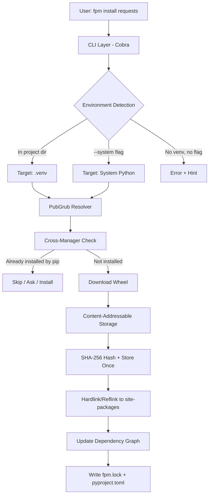
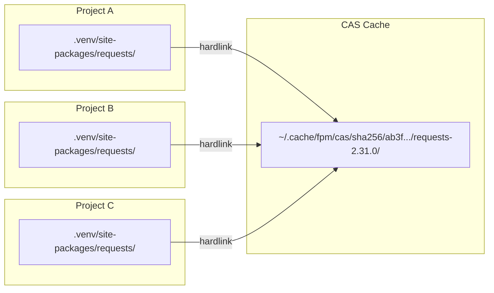
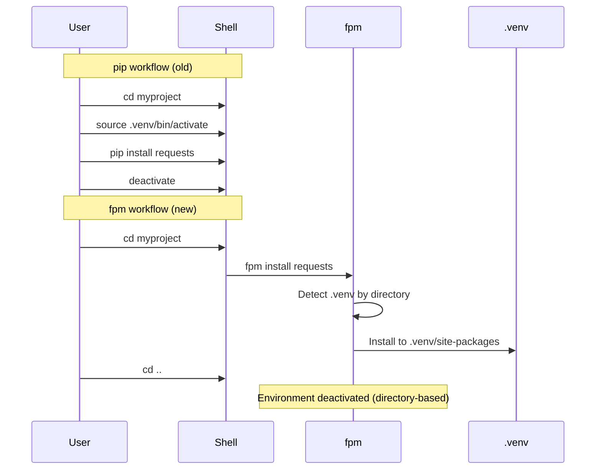

# fpm — Presentation Part 1: The Problem & Solution

## (Slides 1-8 for Gamma AI)

---

## Slide 1: Title

**fpm — Fast Package Manager for Python**

_The package manager that sees everything, breaks nothing, and forgets nothing._

Written in Go. Built for teams. Compatible with everything.

---

## Slide 2: The Problem — Python Packaging is Broken

**Every Python developer has experienced:**

- "I installed something and now my project is broken"
- "Which tool installed this package — pip? conda? poetry?"
- "I need to roll back to yesterday's environment... impossible"
- "10 projects each download their own copy of numpy — 500MB wasted"
- "Someone changed the numpy version in production — who? when?"
- "pip left 47 orphan packages I'll never clean up"

**The root cause:** pip is a downloader, not a manager. It installs packages but
doesn't track, protect, or version your environment.

---

## Slide 3: What fpm Does Differently

| Problem                      | pip / uv         | fpm                    |
| ---------------------------- | ---------------- | ---------------------- |
| "What installed this?"       | No idea          | Shows exact manager    |
| "Roll back to yesterday"     | Impossible       | `fpm snapshot restore` |
| "Lock numpy version forever" | Can't enforce    | `[immutable]` config   |
| "10 projects = 10 copies"    | Yes, wasted disk | One copy, hardlinked   |
| "pip and conda conflict"     | Debug for hours  | Detects + resolves     |
| "Clean up unused packages"   | Manual guesswork | `fpm autoremove`       |

**fpm doesn't replace pip — it coexists.** It sees pip, uv, conda, poetry
packages and manages conflicts intelligently.

---

## Slide 4: Architecture Overview



**Key architectural decisions:**

- Go binary = fast startup, no Python bootstrap
- CAS = zero duplication across all projects
- Dependency graph = knows requested vs transitive
- Directory-based detection = no `source activate` needed

---

## Slide 5: Content-Addressable Storage (CAS)



**How it works:**

1. Download wheel → SHA-256 hash → Store in CAS (once)
2. Install = create hardlinks from CAS to project's site-packages
3. 10 projects using requests = 1 copy on disk
4. Reference tracking ensures GC only removes truly unused packages

**Result:** Install in <50ms (no extraction, just linking)

---

## Slide 6: Smart Dependency Management

```mermaid
graph TD
    subgraph "REQUESTED (protected)"
        flask[flask 3.1.3]
        requests[requests 2.34.2]
    end
    subgraph "DEPENDENCY (removable)"
        jinja2[jinja2 3.1.6]
        click[click 8.4.1]
        werkzeug[werkzeug 3.1.8]
        certifi[certifi 2024.2]
        urllib3[urllib3 2.7.0]
    end

    flask --> jinja2
    flask --> click
    flask --> werkzeug
    requests --> certifi
    requests --> urllib3
```

**Commands:**

```bash
fpm install flask requests    # Both marked as REQUESTED
fpm remove flask              # Removes flask only
fpm autoremove                # Removes jinja2, click, werkzeug (orphans)
                              # Keeps certifi, urllib3 (still needed by requests)
fpm mark --requested click    # Protect click from autoremove
fpm tree                      # Visualize the full graph
```

**This is what apt/pacman do for system packages. fpm brings it to Python.**

---

## Slide 7: Cross-Manager Awareness

```bash
$ fpm list -a
Package    Version    Manager    Location
requests   2.31.0     fpm        .venv/lib/.../site-packages
numpy      1.24.0     pip        .venv/lib/.../site-packages
black      23.1.0     uv         .venv/lib/.../site-packages
scipy      1.10.0     conda      /opt/conda/lib/.../site-packages

$ fpm install numpy
  ⚠ numpy 1.24.0 is already installed via pip — skipping download

$ fpm list --mutable
Package    Version    Manager  Pinned     Location
requests   2.31.0     fpm      🔒 2.31.0  .venv/...
numpy      1.24.0     pip      mutable    .venv/...
```

**fpm detects packages from:** pip, uv, conda, poetry, pdm, system

**Conflict resolution policies:**

- `ask` — prompt the user (default)
- `install` — always install fpm's version
- `skip` — leave existing package alone

---

## Slide 8: No Activation Needed



**How it works:**

- `cd` into project → fpm auto-detects `.venv`
- `cd` out of project → fpm loses venv access
- `VIRTUAL_ENV` env var is intentionally ignored
- Matches how uv's project commands work

**No more forgotten activations. No more installing to wrong venv.**

---
