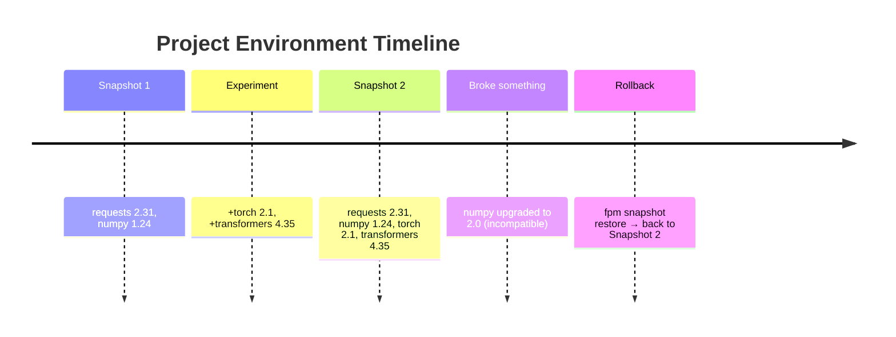
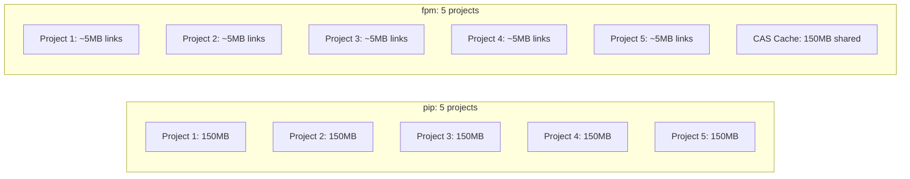

# fpm — Presentation Part 2: Key Features & Live Demo

## (Slides 9-16 for Gamma AI)

---

## Slide 9: Environment Snapshots — Git for Your Packages



**Commands:**

```bash
fpm snapshot create "before experiment"    # Capture exact state
fpm install torch transformers             # Experiment freely
fpm snapshot diff 20260607-143000          # See what changed
fpm snapshot restore 20260607-143000       # Instant rollback

fpm snapshot create --system "sys-v1"      # System-level snapshots too
fpm snapshot list                          # View history
```

**What gets captured:**

- ALL packages from ALL managers (fpm, pip, uv, conda)
- Exact versions
- fpm.toml config (immutable pins)
- Python version info

**What restore does:**

- Re-links fpm packages from CAS (instant, no download)
- Reinstalls pip/uv packages to exact versions
- Removes packages that didn't exist at snapshot time
- Reverts fpm.toml (including immutable config)

---

## Slide 10: Immutable Package Pinning

```toml
# fpm.toml — Production safety net
[immutable]
packages = [
    { name = "numpy", version = "1.24.0" },
    { name = "cryptography", version = "41.0.0" }
]
```

```bash
$ fpm install numpy==2.0.0
  ✗ error: cannot install numpy ==2.0.0
    pinned as immutable at version 1.24.0 in fpm.toml

    hint: Remove the immutable pin from fpm.toml to allow version changes.

$ fpm list --mutable
Package         Version    Manager  Pinned       Location
numpy           1.24.0     fpm      🔒 1.24.0    .venv/...
requests        2.31.0     fpm      mutable      .venv/...
cryptography    41.0.0     fpm      🔒 41.0.0    .venv/...
flask           3.1.3      fpm      mutable      .venv/...
```

**Use cases:**

- Lock security-critical packages (cryptography, jwt)
- Prevent accidental numpy major version bumps
- CI/CD enforcement — no one can override these versions
- Snapshot restore also reverts immutable config changes

---

## Slide 11: Vulnerability Auditing

```bash
$ fpm audit
Auditing 12 packages for vulnerabilities...

  ⚠ requests 2.25.0 — CVE-2023-32681 (HIGH)
    Unintended leak of Proxy-Authorization header
    Fixed in: requests >= 2.31.0

  ⚠ cryptography 39.0.0 — CVE-2023-38325 (CRITICAL)
    X.509 certificate parsing vulnerability
    Fixed in: cryptography >= 41.0.2

Scanned 12 packages — 2 vulnerabilities found.

$ fpm audit --system    # Audit system packages too
```

**How it works:**

- Queries the OSV (Open Source Vulnerabilities) database
- Scans ALL packages regardless of manager
- Shows severity, CVE ID, and fix version
- Works offline with cached vulnerability data

---

## Slide 12: Live Demo — Full Workflow

```bash
# 1. Create project
$ fpm init myproject && cd myproject
  ✓ Created pyproject.toml
  ✓ Created .venv (Python 3.12.13)

# 2. Install packages
$ fpm install flask requests
  Resolving 2 package(s)... done (1.2s)
  ✓ flask 3.1.3, requests 2.34.2 + 9 dependencies
  ✓ Installed 11 package(s) in 45ms

# 3. See what's installed
$ fpm tree
● flask 3.1.3
├── click 8.4.1
├── jinja2 3.1.6
│   └── markupsafe 3.0.3
├── werkzeug 3.1.8
└── itsdangerous 2.2.0
● requests 2.34.2
├── certifi 2024.2
├── charset-normalizer 3.4.7
├── idna 3.18
└── urllib3 2.7.0

# 4. Take a snapshot
$ fpm snapshot create "v1 baseline"
  Snapshot created: 20260610-143000-001
  Packages: 11 total (11 fpm)

# 5. Run your code
$ fpm run python app.py
  * Running on http://127.0.0.1:5000

# 6. Leave the project (auto-deactivates)
$ cd ..
$ fpm list
  ✗ error: no virtual environment found
```

---

## Slide 13: Live Demo — Disaster Recovery

```bash
# Someone upgraded numpy in production...
$ cd myproject
$ fpm install numpy==2.0.0
  ✓ Installed numpy 2.0.0

# Oh no, everything broke!
$ fpm snapshot diff 20260610-143000-001
  + numpy 2.0.0 (fpm)

# Instant rollback
$ fpm snapshot restore 20260610-143000-001
  Restoring...
  ✓ Restored 11 fpm-managed packages from cache
  Environment restored.

# Verify
$ fpm list | grep numpy
  (not present — as it was before)

# Lock it down permanently
$ cat >> fpm.toml << 'EOF'
[immutable]
packages = [{ name = "numpy", version = "1.24.0" }]
EOF

$ fpm install numpy==2.0.0
  ✗ error: pinned as immutable at 1.24.0 in fpm.toml
```

---

## Slide 14: Live Demo — Cross-Manager Coexistence

```bash
# Data scientist used pip to install pandas
$ pip install pandas

# fpm sees it immediately
$ fpm list -a
Package     Version  Manager  Location
flask       3.1.3    fpm      .venv/.../site-packages
pandas      2.2.0    pip      .venv/.../site-packages
numpy       1.24.0   pip      .venv/.../site-packages

# Try to install numpy via fpm
$ fpm install numpy
  ⚠ numpy 1.24.0 is already installed via pip — skipping

# Force install (fpm takes ownership)
$ fpm install numpy --force
  ✓ numpy 1.24.0 (fpm, was: pip)

# Audit everything regardless of manager
$ fpm audit
  Scanned 5 packages — no vulnerabilities found.
```

---

## Slide 15: Performance & Storage



| Metric                    | pip             | fpm                     |
| ------------------------- | --------------- | ----------------------- |
| 5 projects with same deps | 750MB           | 175MB                   |
| Install after first cache | 3-10s           | <100ms                  |
| Startup time              | ~500ms (Python) | <10ms (Go binary)       |
| Dependency resolution     | Backtracking    | PubGrub (deterministic) |
| Uninstall cleanup         | Manual          | Automatic (autoremove)  |

---

## Slide 16: Summary & What's Next

**fpm solves 6 fundamental problems:**

1. ✅ **Visibility** — See ALL packages from ALL managers in one view
2. ✅ **Reversibility** — Snapshot + instant rollback (like git)
3. ✅ **Safety** — Immutable pins prevent accidental version changes
4. ✅ **Efficiency** — Zero-duplication via CAS + reflinks
5. ✅ **Intelligence** — Knows requested vs dependency, auto-cleans orphans
6. ✅ **Security** — Built-in vulnerability scanning (OSV database)

**Tech Stack:**

- Go 1.25 (single binary, no runtime deps)
- PubGrub resolver (deterministic, fast)
- Content-Addressable Storage (SHA-256)
- Supports: macOS, Linux, Windows, Docker

**Get Started:**

```bash
curl -fsSL https://raw.githubusercontent.com/Kartikey2011yadav/fpm/main/install.sh | bash
fpm init myproject && cd myproject
fpm install requests flask numpy
```

**Links:**

- GitHub: github.com/Kartikey2011yadav/fpm
- Docs: fpm/docs/concepts/README.md

---
